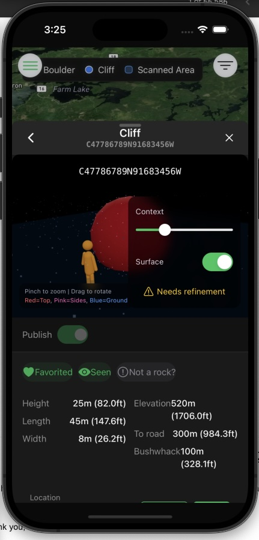

2026-01-19 2:45pm
Name: the app is currently called rock Scout. Let's rename it Rockpile. 

## Main map:

Let's move the filter dropdox to just above the map layers button and make it look like a filter.

Let's move the legend to the right instead of top left because the settings hamburger is blocking the "boulder" legend.

Let's shrink the legend and text a bit. 

We don't seem to be actually loading my map with my custom pmt files etc. This just has fake files. Let's start showing my actual map. With my actual features. See the external-component-generators/step5_make_map.py to see the exact format of the map. 

When you click the "i" at the bottom right, the map is showing "openstreetmap" at the bottom and says "improve this map"...why are we using OSM? My map uses MapBox. We should remove this information "i" also. And it says "map box" in the lower left. Can I get rid of that?

When we turn off satellite, we lose the 3-D shape of the terrain. Can we turn off satellite but keep 3-D shape??

## Filter

The filters seem to be working on the map (of course, with the fake data)

They look OK for now. But the different types of filters have those little drop-down arrows. Whenever you click on a filter, it immediately closes the drop-down and makes that filter disappear. This is bad behavior. However, I think we should just get rid of the drop-down's. We don't have that many filters. We can just show them all. Then the person can just scroll down and click the ones they want.

## Feature-poup. 

### Title
The title is fine, and also shows the ID.

### 3-D plot.
This looks like it is still a simulated 3-D viewer. We should be pulling actual 3-D plots from my back blaze set up. These are built into the map structure that I already have made. (urls are listed in the PMT files).

There are some changes needed to the 3d viewer. I am writing them down here so that I can make them in the external tool: (1) We don't need the ID of the feature at the top, because that is displayed above in the title of the pop-up window. (2) we don't need to display any of the data about the feature, because that will be displayed below. We just need the surface toggle, and the context slider. Although I do like the appearance of the contacts and surface sliders here, which are on a semi-transparent, black, rounded rectangle, with green background, little circles for dragging. See . Also, let's take the "needs refinement" out of this.

### Publish button
Looks good, except the circle is a little too small for the button

### Top buttons
The buttons for favorite, scene, and not a rock?just barely fit the text. They need a little bit more buffer. Instead of not a rock? Let's make this "suggest a fix". This pop-up menu does not need to show. "clear (it is a rock)". That's the same thing as clicking cancel. In addition to the three options tree, building, other, we should add an option for "missing part of the rock" and another one for "includes some non-rock".

### Stats section
These need a little bit of formatting work. Height, length, width in the left column: these words should be right justified. And then the values should be left justified next to them. That way, the values are all in a straight column. Same thing for elevation, two road, bushwhack, and their values. Also, these show meters, as well as feet. This should use the users overall setting for preferring metric or imperial.

### location section
This looks good, although we should add more Precision to the coordinates if we are going to show any.

### Climbs section
This looks good. We should have a section of "unpublished" climbs first, then a section of public climbs. 

If you click on a climb, it should allow you to change your rating of the difficulty and of the stars rating, and change the status between sent/flashed and nothing (blank), and the status should be sent instead of send. There needs to be something that you can click on, clearly to expand the information about a climb, and this would swipe in from the left and show you pictures, comments, and allow you to change the status for yourself.

### + Climb
Eventually, we should populate the name field with something generated by AI. Later feature.

Where it says V scale NYDS, these just have an ugly green rectangle around them, and there is not enough buffer on the sides. Maybe the green is OK, but we need a little more space to the left and right. In the table of difficulties, we should have a little more space above and below each difficulty. Right now the boxes are just at the top and bottoms of the letters. Under status, it should say "sent" instead of "send". Similar with the boxes, they need more buffer on the left and right, they are almost a budding the letters. These are the green boxes in the background.

"Tag a photo" needs to do something when you click on the photo. It needs to pop up the photo annotation screen.

Before "tag a photo", we should have "add a photo" with a + or something that takes you to the normal photo adding screen where you can either take a picture or select one from your library, and then it gives you the option to add notes to the photo and you can draw on it.

### Links 
When you click "+ Add" for links, it should also have a choice button below it that says mountain project, video, other, and there should be another text field for "description. Also, where it says "paste URL in the text box, the text needs to be moved to the right a little bit. It is directly at the left hand of the text box with no space.

### Photos
Pretty good. Let's make sure that if there are multiple photos, they are displayed in a single row where you can just scroll from left to right. 

When you click the add button, shows three options: photo library, take photo, and choose file. It should not show choose file.

We need to make sure that when you do add a photo, it takes you to the annotation frame before you click OK.

Comments seem OK but have a few issues. The thumbs up doesn't work. Also, when you click reply, it just creates a new post at the bottom, it should indent it underneath the comment to which you are replying. 

When you click the… On your own message and tap added, nothing happens. Same thing for delete.

### Missing

Let's add a new section right underneath the stats and location, above "climbs" called
"Description". This will show the publicly available description. If you tap on it, you can edit it, and this will be a publishable change. If it is empty, it will just be an empty field, where you can tap and start typing.

Underneath this will be a section calledQuick notes (private). This can have a little question mark Next to it. If you tap the. question mark, it will pop up a small note saying "quick notes for your eyes only. If you want to make public notes, add a comment below"

##  hamburger menu
When we click the main hamburger menu, it looks fine, pretty much.

The headings for the sections need a little bit more space on their left. They are basically squished up against their icons. Like "settings" or "dark mode" need a little more space to their left.

Importantly, there There is  redundancy in the menu. Inside the hamburger menu, we have a "settings", and inside that there is profile, appearance, and so on. We should just move each of these items out to the m. Then when you click on them, they just take you to that sub menu without having to have the screen divided in half left to right. And this makes sense because there is also a main menu item for data and storage (which doesn't go anywhere). We can move the sub menu out of "settings for data and off-line" to there. Similarly there is a setting for privacy and security in the main menu, and this goes nowhere. We should move the privacy security settings out of "settings to here.

I will now review the appearance and functionality of each sub menu. 

### My Profile
This looks OK, but the little mountainproject and youtube links don't look like links, just tiny icons. Also, I should be able to just tap on my picture to replace it, tap on my name to change my name, tap on my description to change it, tap on the links to change them. This is rather than having to go back and click "settings" to edit my profile. We should move the "profile" settings out of the "settings" sub menu and just have the profile page be editable.

### Settings
As mentioned above, we don't need this. The whole menu is settings. We will move all of the sub menus out of here. But I will still explain some things that need to change in these based on appearance.

When I click on, "Appearance", Under "Display", the buttons for distance units don't look like buttons. They are just green dots with nothing around them. So you can't tell that you're supposed to click there. And the metric and imperial buttons are shown in a row, so the imperial button hangs off the right side of the screen, and you can't read it. Maybe they choice buttons should always be in columns?

The map section seems fine, these are in a column.

When I click on "Data & Offline", The buttons are ugly. They are just square green boxes with a black circle in them. Shouldn't they be around? Shouldn't they have a kind of a 3-D toggle look like the "published" toggle on the pop-up?

Same for "privacy". The push notifications toggle is ugly.

 The published content section with the "unpublished on my content button, the button doesn't look like a button. It's just a red rectangle. And unpublished all my content does not fit inside the button, so it hangs off the sides.

 ### Offline Regions
 This looks pretty good. What is the storage total storage coming from? Is that what's available on the device? Or is that the maximum allowed for the app? We need to either make sure that this is tied to something real, or just get rid of it.

And obviously, these are not tied to anything, they are just fake data, we need to link them up at some point.

### Dark Mode
This is a nice rounded toggle button, like I would expect. Green, rounded, with a white circle. Not like those other weird square ones with dark circles. But let's not have dark mode here. Let's make this a sub menu called appearance. When you click on it, you get the dark mode toggle plus all of the other toggles that were available under the "appearance" sub sub menu under "settings" sub menu.

 I note that the imperial versus metric toggle doesn't do anything. The text seems to be hardcoded in the information display page. When the user selects these, we should save them to their profile online and apply them across the app.

 ### Data & Storage
 This is fine, and when you click on it, it should show you the options that were listed in the sub sub menu "data & offline" in the sub menu "settings". When the user clicks on these and makes a choice, we should save them to their profile.

### Privacy & Security
This does nothing. When you tap it, it should take you to a sub menu that is the content from the "privacy" sub sub menu currently under "settings" sub menu.

### Help & Support
This should take you to a page with a simple form to submit a comment with a subject, and it should also contain the support email address, with a mail to link.

And we need to set up the support form at some point.

### Send Feedback
Let's remove this. It's redone it with help and support.

### General
Whenever you are in a sub menu and you click the X, it just pops you back onto the map, rather than putting you back on the hamburger menu like I would expect.

